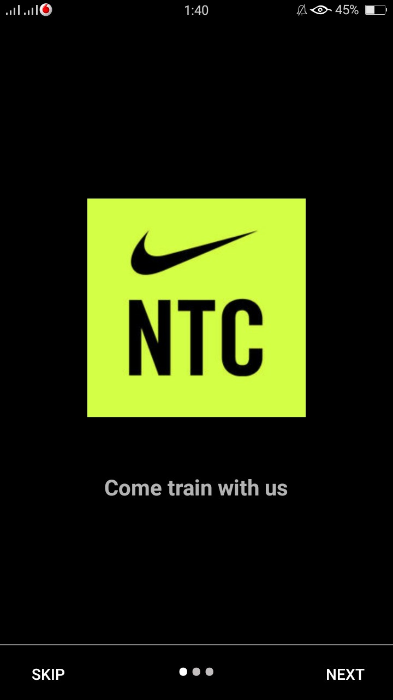
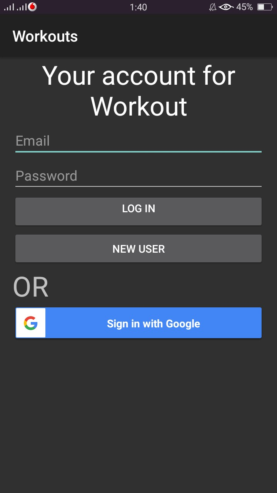
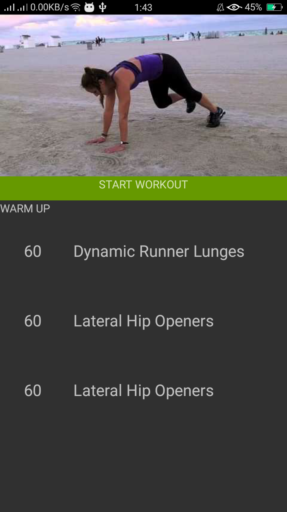

# Fitness App

Developed a Fitness App inspired by Nike Training Club App + Nutrition App during 6th semester as a part of course project.

# API Used
 - YouTube Android API to display exercise video
 - Google TextToSpeech API to speak out during the training session
 - Google Fit API to count the total number of steps
 
# Screenshots

